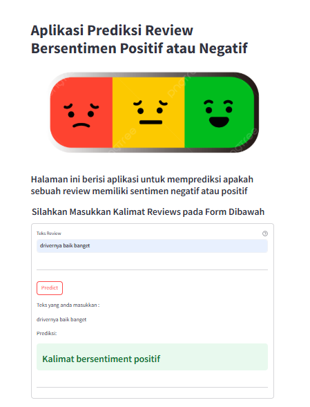

# Sentiment Analysis Gojek Menggunakan Model NLP

## I. Repository Outline
1. README.md - Penjelasan gambaran umum project
2. Sentiment Analysis.ipynb - Notebook yang digunakan untuk proses pengolahan data dan membangun model machine learning
3. Model Inference - Notebook yang digunakan untuk uji coba model machine learning
4. url.txt - Link dataset dan model deployment
5. Deployment/ - Folder berisi kode program model deployment
6. Web-deployment.png - Gambaran aplikasi prediksi sentiment analysis

## II.  Problem Background
Go-Jek merupakan salah satu penyedia layanan transportasi online terpopuler di Indonesia.
Gojek menyediakan berbagai layanan lengkap mulai dari transportasi, logistik, pembayaran, layanan pesan-antar makanan, dan berbagai layanan lainnya.
Dibandingkan dengan layanan sejenis dari kompetitor, Go-Jek masih menjadi on-demand mobile platform yang paling diminati di Indonesia.

Untuk dapat mempertahankan layanan terbaik kepada konsumen, Go-Jek harus mampu meningkatkan layanan dalam berbagai aspek terutama terkait dengan kepuasan pelanggan.
Salah satu cara untuk mengetahui tingkat kepuasan pelanggan yaitu dengan melihat reviews aplikasi GoJek yang ada di Google Play Store.
Reviews yang baik akan meningkatkan rating aplikasi sehingga dapat menambah pelanggan baru dan menjaga stabilitas perusahaan. Sedangkan rating yang buruk dapat mempengaruhi pengguna untuk beralih ke kompetitor lain.

## III. Objective
Project ini bertujuan untuk membuat sebuah model machine learning yang dapat menentukan apakah sebuah teks (reviews) bersentiment positif atau negatif. \
Kemudian memberikan rekomendasi kepada perusahaan Go-Jek mengenai strategi bisnis yang dapat digunakan berdasarkan hasil analisis data dan sentimen pelanggan.

## IV. Project Output
Hasil dari project yang dibuat antara lain :
1. Model machine learning untuk memprediksi kalimat bersentimen positif / negatif
2. Rekomendasi perusahaan mengenai strategi bisnis yang dapat digunakan
3. Website yang dapat digunakan untuk menggunakan model yang telah dibuat
4. Insight mengenai potensi bisnis yang dapat dilakukan.

## IV. Data
Dataset diambil dari kaggle dengan judul 'gojek app reviews bahasa indonesia'. Dataset berisi review user terhadap aplikasi gojek yang diambil dari aplikasi Google Play dari tahun 2021 hingga 2024.
Dataset terdiri dari 5 kolom dan 200.000+ baris data.

## V. Method
Algoritma machine learning yang digunakan adalah Artificial Neural Network (ANN) sebagai model klasifikasi. \
Metrics evaluasi yang digunakan antara lain histogram untuk melihat performa model, confusion matrix untuk melihat hasil prediksi benar & salah, dan f1 score untuk melihat performa model dalam mendeteksi False Positive (FP) dan False Negative (FN).

## VI. Stacks
Proses pengolahan data dilakukan menggunakan aplikasi VSCode dengan bahasa pemrograman Python Terdapat beberapa library yang digunakan untuk mempermudah proses analisis data, yaitu:
| No. | Library | Fungsi |
| --- | --- | ---|
|1. | Pandas | Memproses dataset |
|2. | Scipy | Melakukan perhitungan statistik |
|3. | Seaborn | Menggambarkan visualisasi data |
|4. | Tensorflow | Library machine learning |
|5. | Scikit-Learn | Data pre-processing |
|5. | Word2Vec | Library untuk word embedding |
|6. | Sastrawi | Library stopword bahas indonesia |
|7. | Wordcloud | Menampilkan kata-kata |
|8. | HuggingFace | Deployment model |

## VII. Reference

Dataset dapat diakses pada link berikut:
[Dataset](https://www.kaggle.com/datasets/ucupsedaya/gojek-app-reviews-bahasa-indonesia) 

Model Deployment dapat diakses pada link berikut:
[Aplikasi](https://huggingface.co/spaces/prasetyoaji/Sentiment_Analysis_Gojek) 

Gambar tampilan Hasil Web Deployemnt:

